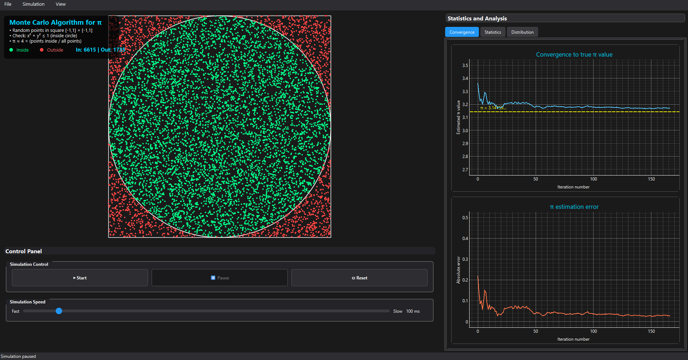
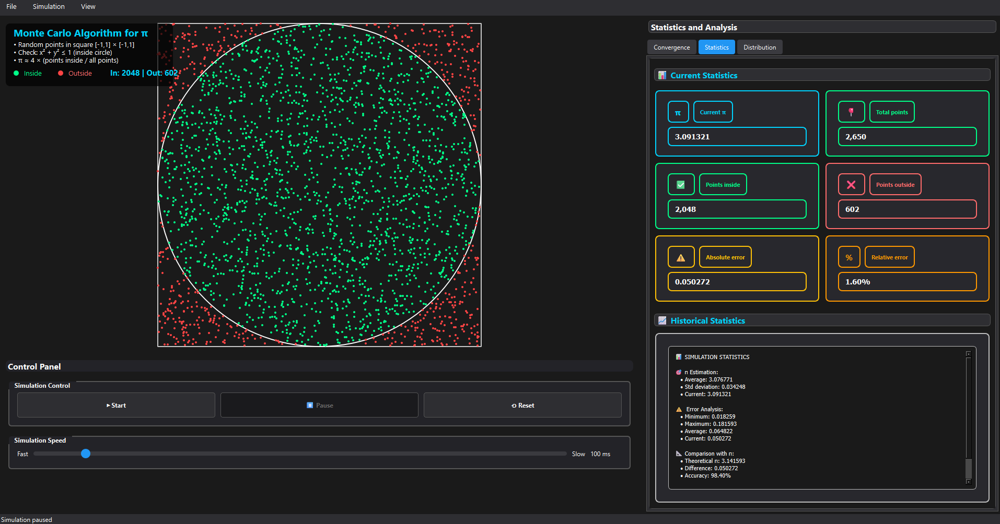
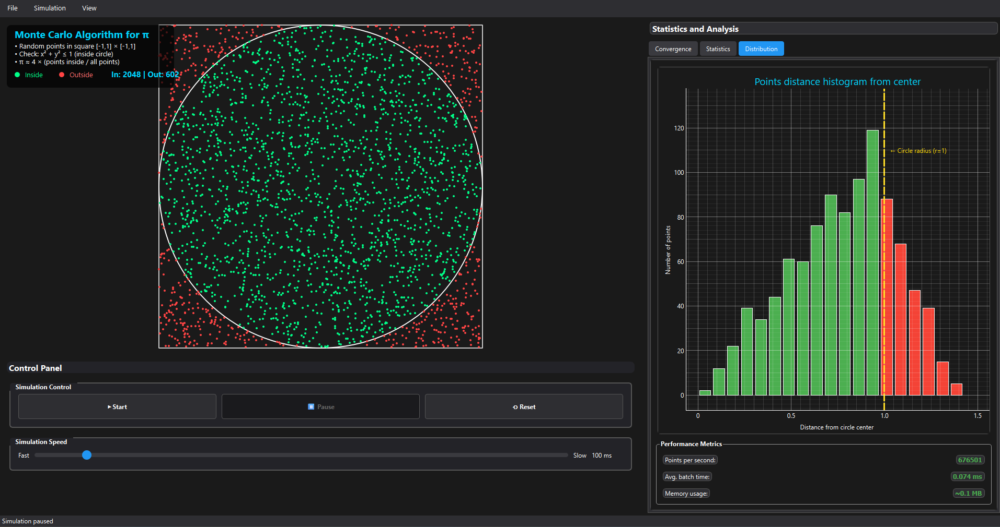

# Monte Carlo π Visualization

A professional interactive application that demonstrates the Monte Carlo method for estimating the mathematical constant π (pi). Built with Python and PySide6, this educational tool provides real-time visualization and comprehensive statistical analysis.



## 🎯 Overview

The Monte Carlo method estimates π by randomly generating points within a square and counting how many fall inside an inscribed circle. As the number of points increases, the ratio approaches π/4, allowing us to estimate π ≈ 4 × (points inside circle / total points).

## ✨ Features

### 🎮 Interactive Simulation
- **Real-time Visualization**: Watch thousands of points being generated and plotted in real-time
- **Animated Point Generation**: Smooth animations for newly generated points with fade-in effects  
- **Color-coded Points**: Green points inside the circle, red points outside for clear visual distinction
- **Educational Algorithm Display**: Built-in explanation of the Monte Carlo method with mathematical formulas
- **Large Scale Support**: Handle up to 100,000 points with optimized rendering performance

### 📊 Comprehensive Statistics


- **Live Statistics Cards**: Real-time display of current π estimate, total points, inside/outside counts
- **Error Metrics**: Track absolute and relative errors with color-coded warning indicators
- **Historical Analysis**: Detailed statistical summary including mean, standard deviation, and accuracy
- **Performance Tracking**: Monitor computation time and points per second metrics

### 📈 Advanced Analytics  


- **Convergence Analysis**: Interactive plots showing how the estimate converges to the true value of π
- **Error Evolution**: Track how estimation error decreases as more points are added
- **Point Distribution Histogram**: Visualize the spatial distribution of generated points by distance from center
- **Performance Metrics**: Real-time monitoring of points per second, batch processing time, and memory usage

### ⚙️ Simulation Control
- **Start/Pause/Reset**: Full control over simulation execution with intuitive buttons
- **Variable Speed**: Adjustable simulation speed from 10ms to 1000ms per iteration 
- **Batch Processing**: Optimized point generation for smooth performance across different hardware
- **Real-time Status**: Live updates in the status bar showing current progress and accuracy

## 🚀 Technical Features

- **High Performance**: Optimized batch rendering for smooth visualization of large datasets
- **Modern UI**: Professional dark theme with color-coded statistics cards and intuitive controls
- **Real-time Updates**: Live updating of all statistics, plots, and visualizations 
- **Educational Design**: Built-in explanations, mathematical formulas, and color-coded visual cues
- **Cross-platform**: Runs seamlessly on Windows, macOS, and Linux
- **Memory Efficient**: Intelligent memory management for handling large point datasets

## 📋 Requirements

- **Python 3.8+**
- **PySide6** - Modern Qt6 bindings for Python
- **NumPy** - Numerical computing and array operations  
- **PyQtGraph** - High-performance real-time plotting
- **Matplotlib** - Additional plotting capabilities

## 🛠️ Installation

1. **Clone the repository:**
```bash
git clone https://github.com/your-username/montecarlo-visualization.git
cd montecarlo-visualization
```

2. **Install required dependencies:**
```bash
pip install PySide6 numpy matplotlib pyqtgraph
```

3. **Run the application:**
```bash
python main.py
```

## 📖 How to Use

### Getting Started
1. **Launch Application**: Run `python main.py` from the project directory
2. **Start Simulation**: Click the "▶ Start" button to begin generating random points
3. **Monitor Progress**: Watch the π estimate converge in real-time in the status bar
4. **Control Speed**: Use the speed slider to adjust simulation pace (Fast ←→ Slow)

### Exploring Features
- **Convergence Tab**: View interactive plots showing how your estimate approaches the true value of π
- **Statistics Tab**: Analyze current statistics with color-coded cards and detailed historical data
- **Distribution Tab**: Examine point distribution histogram and performance metrics
- **Right-click Canvas**: Toggle coordinate grid for better visualization

### Keyboard Shortcuts
- `Ctrl+R` - Reset current simulation
- `Ctrl+T` - Toggle statistics panel visibility  
- `Ctrl+Q` - Exit application
- `Right-click on canvas` - Toggle coordinate grid

## 🧮 How the Monte Carlo Algorithm Works

### The Mathematical Foundation
1. **Generate Random Points**: Create random points within a square [-1,1] × [-1,1]
2. **Test Circle Inclusion**: Check if each point satisfies x² + y² ≤ 1 (inside unit circle)  
3. **Calculate Ratio**: Compute (points inside circle) / (total points) ≈ π/4
4. **Estimate π**: Use the formula π ≈ 4 × ratio

### Theoretical Background
- **Circle Area**: π × r² = π (for unit circle, r=1)  
- **Square Area**: (2r)² = 4 (for square containing unit circle)
- **Area Ratio**: π/4 (circle area / square area)
- **Law of Large Numbers**: As n→∞, our estimate→π with high probability

### Why It Works
The Monte Carlo method leverages the **Law of Large Numbers** - as we increase the number of random samples, our estimate becomes increasingly accurate. The visual representation makes this convergence process intuitive and educational.

## 🎓 Educational Value

This application serves as an excellent educational tool for:

### Mathematics & Statistics
- **Monte Carlo Methods**: Understanding probabilistic numerical techniques
- **Convergence Theory**: Observing how random sampling approaches theoretical values
- **Error Analysis**: Learning about accuracy, precision, and statistical confidence
- **Geometric Probability**: Visualizing area-based probability calculations

### Computer Science
- **Algorithm Visualization**: See abstract computational concepts in action
- **Performance Optimization**: Understanding batch processing and memory management
- **GUI Development**: Modern application design patterns with Qt/PySide
- **Real-time Graphics**: High-performance rendering techniques

## 🏗️ Project Architecture

### Clean Code Structure
```
montecarlo-visualization/
├── main.py                 # Application entry point with error handling
├── app-screenshot*.png     # Application screenshots for documentation  
├── README.md              # This comprehensive documentation
└── src/
    ├── core/
    │   └── monte_carlo.py  # Core Monte Carlo algorithms and data structures
    ├── ui/
    │   ├── main_window.py  # Main Qt application window and coordination
    │   └── widgets/
    │       ├── simulation_canvas.py   # Real-time visualization canvas
    │       ├── control_panel.py       # User control interface  
    │       └── statistics_panel.py    # Advanced statistics and plotting
    └── utils/
        └── colors.py       # UI theming and color management
```

## 🔧 Technical Implementation

### Core Optimizations
- **Batch Point Generation**: Using NumPy arrays for efficient random number generation
- **Optimized Rendering**: Color-grouped drawing to minimize individual draw calls
- **Memory Management**: Intelligent point limiting to prevent memory overflow
- **Responsive UI**: Non-blocking updates using Qt's event system

### Performance Characteristics
- **Scalability**: Handles 100,000+ points with smooth real-time updates
- **Memory Efficient**: Constant memory usage regardless of simulation length
- **Cross-platform**: Consistent performance on Windows, macOS, and Linux
- **Hardware Adaptive**: Adjusts rendering quality based on available resources

## 📊 Sample Results & Accuracy

### Expected Accuracy by Sample Size
- **100 points**: π ≈ 3.16 (error ~0.02, accuracy ~99.4%)
- **1,000 points**: π ≈ 3.148 (error ~0.006, accuracy ~99.8%)  
- **10,000 points**: π ≈ 3.1416 (error ~0.0001, accuracy ~99.997%)
- **100,000 points**: π ≈ 3.14159 (error ~0.00001, accuracy ~99.9997%)

### Error Convergence Theory
The estimation error follows the **Monte Carlo convergence rate**: error ≈ 1/√n, where n is the number of sample points. This means that to gain one digit of accuracy, we need approximately 100× more samples.


## 👨‍💻 Author

**Jakub Krasuski**
